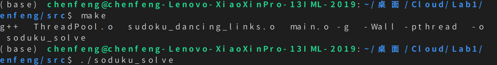
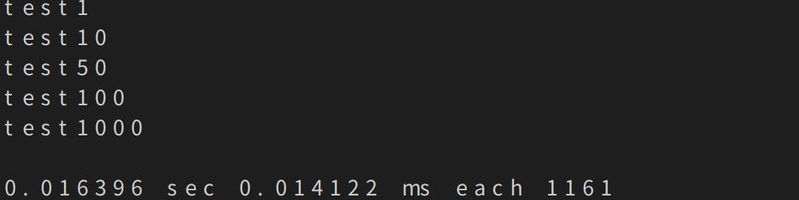

# SudokuSolve written by 陈枫

## how to run

Input `make` to compile these codes.

Input `./sudoku_solve` in the command line,like the following chart.

Then input the test file,such as test1 , test10 and etc. All the test files are placed in the folder `datafiles`.

Press enter twice `return key` to end the input , then you will find out how fast `sudoku_solve` runs.

