# 1、how to run

源代码位于文件夹`/submit/src/Suduku`中，cd进入该目录中

`make`进行编译

输入`./sudoku_solve`,程序开始运行

然后输入要测试的文件名如`test1`,输入一个文件名后回车，**注意：一行一个文件名**

连续输入两个`回车`键，结束输入，程序开始运行

在程序运行的过程中，仍然可以从终端接收测试文件的输入

如下图：

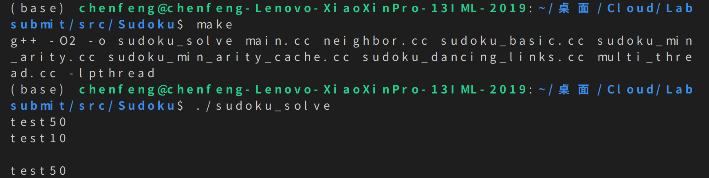

程序运行结束后，即可得到，解的数独个数以及解这些数独需要的时间

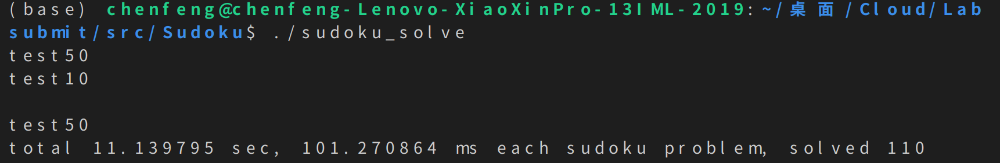

**默认使用dancelink算法，参数a-sudoku_min_arity算法，参数b-基础解法，参数c-sudoku_min_arity_cache算法**

# Repoprt：
# 2、性能测试报告

## 2.1性能指标

&emsp;实验以求解完单个输入文件里的所有数独题并把数独的解按顺序写入文件所需要的时间开销作为性能指标。一般而言，可以用加速比直观地表示并行程序与串行程序之间的性能差异（加速比：串行执行时间与并行执行时间的比率，是串行与并行执行时间之间一个具体的比较指标）。

## 2.2代码实现版本

&emsp;&emsp;实验中共使用两份不同的代码：**Code1**和**Code2**。

&emsp;&emsp;**Code1:** 原生的数独求解代码，即本实验中所提供的代码，只能以单线程模式运行。

&emsp;&emsp;**Code2:** 为适应多线程而在Code1上进行了一系列的修改和增添而成。在Code2中，可通过参数的调节而控制数独算法。

&emsp;&emsp;如无特别说明，默认使用Code2。

# 3、性能测试

## 3.1 单线程与多线程的比较

单线程使用Code1代码；多线程使用Code2代码，默认6个线程

1、当使用dance-link算法时，1000个数独要解

单线程结果如下：

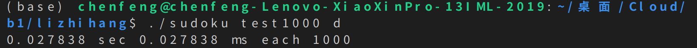

多线程结果如下：

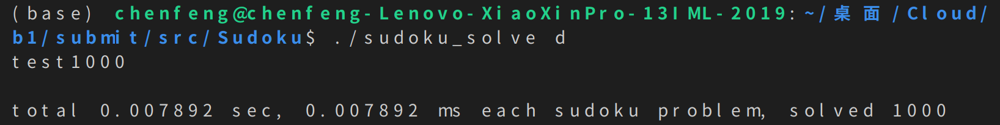

加速比约等于3.53:1

2、当使用sudoku_min_arity算法时，1000个数独要解

单线程结果如下：

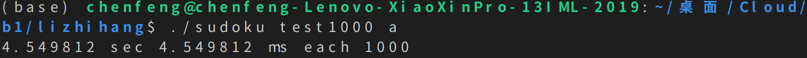

多线程结果如下：

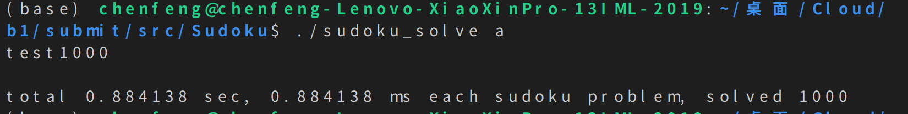

加速比约等于5.15:1

3、当使用sudoku_min_arity_cache算法时，1000个数独要解

单线程结果如下：

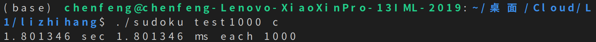

多线程结果如下：

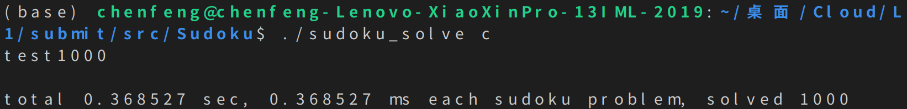

加速比约等于4.88:1

4、当使用基础解法时，50个数独要解

单线程结果如下：

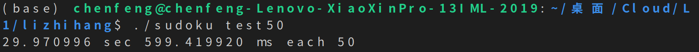

多线程结果如下：

加速比约等于4.91:1

## 3.2 不同硬件环境性能比较

多线程均采用6个线程

3.1 环境1

单线程：

多线程：

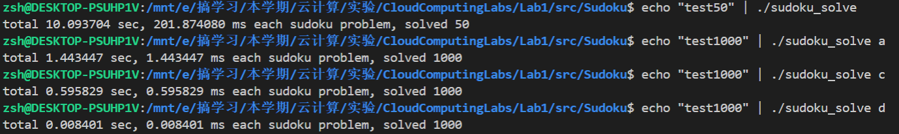

3.2 环境2

单线程：

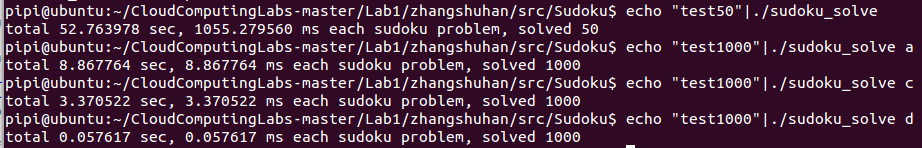

多线程：

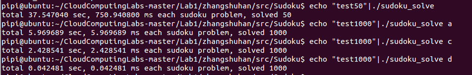

3.3 环境3即为上述单线程与多线程比较的环境

**通过比较，可得，四种算法的加速比在不同的环境下均差不多**

